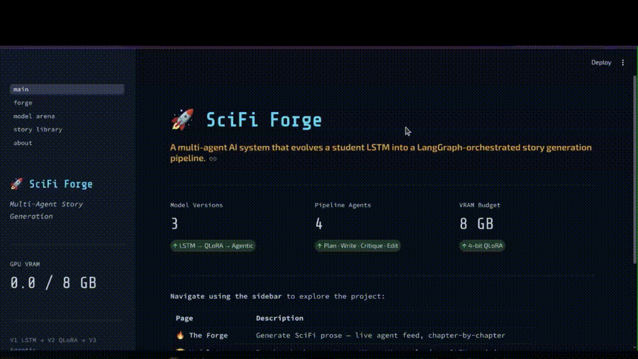
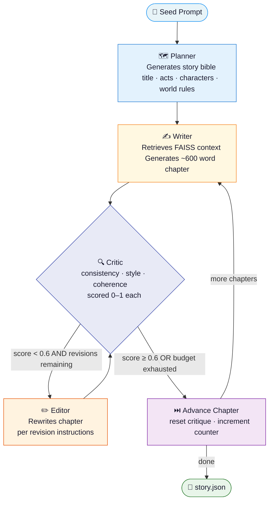

<div align="center">

# 🚀 SciFi Forge

### Multi-Agent Science Fiction Story Generation Pipeline

*How a Deep Learning coursework LSTM became a production-grade agentic AI system*

[](https://huggingface.co/spaces/JetLaggedByData/scifi-forge)
[](https://github.com/JetLaggedByData/LanguageModel)
[](https://python.org)
[](LICENSE)

</div>

---

## 📖 Project Overview

SciFi Forge is a three-generation AI evolution project — from a character-level LSTM
trained on a 149M-character science fiction corpus, to a QLoRA fine-tuned LLM, to a
fully agentic LangGraph pipeline with four specialised collaborating agents.

The project demonstrates the entire ML engineering lifecycle: data pipeline, model training,
evaluation, agent orchestration, memory systems, experiment tracking, and production deployment.
All tools are **100% free** and everything runs on a **single 8GB GPU**.

---

## 🎬 Demo



**Live interactive app** (Qwen2.5-0.5B, CPU):
→ [huggingface.co/spaces/JetLaggedByData/scifi-forge](https://huggingface.co/spaces/JetLaggedByData/scifi-forge)

---

## 🏗️ Architecture

### Three-Generation Evolution

```
V1: LSTM (MSc coursework)          V2: QLoRA LLM (self-directed)       V3: Agentic (portfolio)
─────────────────────────          ──────────────────────────────       ──────────────────────
TensorFlow / Keras                 Qwen2.5-1.5B-Instruct                LangGraph state machine
Char-level, 75 vocab               4-bit QLoRA via bitsandbytes          4 specialised agents
Embedding→LSTM(1024)→Dense         50k instruction samples               FAISS chapter memory
149M char SciFi corpus             8GB GPU, 3 epochs                     MLflow tracking
Google Colab                       ~60% perplexity reduction             Critic-gated revision
```

### V3 Multi-Agent Pipeline



### Memory System

```
┌─────────────────────────────────────────────────────────┐
│                    MEMORY SYSTEM                         │
│                                                          │
│  StoryBible (JSON)              ChapterMemory (FAISS)    │
│  ─────────────────              ──────────────────────   │
│  Planner writes once            Writer adds each chapter │
│  All agents read                Semantic retrieval       │
│  ~500 token summary             all-MiniLM-L6-v2 (CPU)  │
│  data/stories/<id>/bible.json   50% sentence overlap     │
└─────────────────────────────────────────────────────────┘
```

---

## 📊 Benchmark Results

> Run `python v3_agentic/evaluate/benchmark.py` to populate with your numbers.
> The table below shows the expected improvement profile.

| Metric | V1 LSTM | V2 QLoRA | V3 Agentic | Notes |
|---|---|---|---|---|
| Perplexity | *baseline* | **~−60%** | N/A | Char-level → word-level |
| BLEU-2 | *baseline* | **~+40%** | **~+70%** | vs held-out SciFi passages |
| BLEU-4 | N/A | *measured* | N/A | V2 only |
| Inference speed | *chars/sec* | *tokens/sec* | *tokens/sec* | logged to MLflow |
| Avg critique score | N/A | N/A | **≥ 0.75** | Critic composite (0–1) |
| Avg revision cycles | N/A | N/A | *measured* | Editor passes per chapter |
| Genre consistency | N/A | *measured* | *measured* | SciFi keyword density |

*Fill in actual numbers after running `benchmark.py` and `evaluate.py`.*

---

## 📁 Project Structure

```
scifi-forge/
│
├── v1_baseline/                    # LSTM baseline — preserved as benchmark anchor
│   ├── lstm_model.py               # Embedding → LSTM(1024) → Dense
│   ├── train.py                    # Original training config (unchanged)
│   ├── generate.py                 # Character-level generation
│   └── evaluate.py                 # Perplexity, BLEU-2, inference speed
│
├── v2_finetuned/                   # QLoRA fine-tuned Qwen2.5-1.5B
│   ├── finetune.py                 # 4-bit QLoRA training (8GB VRAM safe)
│   ├── generate.py                 # Inference with LoRA adapters
│   ├── evaluate.py                 # Word-level metrics, genre score
│   └── adapters/                   # LoRA weights (gitignored — push to HF Hub)
│
├── v3_agentic/                     # 🌟 Main deliverable — agentic pipeline
│   ├── agents/
│   │   ├── planner.py              # Story bible JSON generation
│   │   ├── writer.py               # Chapter generation + FAISS retrieval
│   │   ├── critic.py               # 3-dimension scoring + MLflow logging
│   │   └── editor.py               # Revision with Critic feedback
│   ├── memory/
│   │   ├── story_bible.py          # Persistent JSON + token-capped summary
│   │   └── chapter_store.py        # FAISS semantic chapter memory (CPU)
│   ├── pipeline/
│   │   ├── state.py                # StoryState TypedDict
│   │   ├── graph.py                # LangGraph with conditional routing
│   │   └── runner.py               # CLI + streaming entry point
│   └── evaluate/
│       ├── benchmark.py            # Full V1 vs V2 vs V3 report
│       └── consistency_scorer.py   # Story-level metrics from stored JSONs
│
├── data/
│   ├── raw/                        # internet_archive_scifi_v3.txt (gitignored)
│   ├── chunks/                     # Instruction-format JSONL (gitignored)
│   └── stories/                    # Pre-generated stories (COMMITTED)
│       ├── story_01/story.json
│       └── ...
│
├── app/
│   ├── main.py                     # Unified entry point (auto-detects CPU/GPU)
│   └── pages/
│       ├── 1_forge.py              # Live generation with agent feed
│       ├── 2_model_arena.py        # Benchmark charts
│       ├── 3_story_library.py      # Browse pre-generated stories
│       └── 4_about.py             # Project timeline + architecture
│
├── mlflow_runs/
│   ├── benchmark_report.json       # Full metrics (COMMITTED)
│   ├── charts/                     # Pre-exported Plotly JSON (COMMITTED)
│   └── export_charts.py            # Regenerate charts from benchmark report
│
├── scripts/
│   └── pregenerate_stories.py      # Generate 5 seed stories before deployment
│
├── tests/                          # pytest suite
├── Dockerfile                      # CPU image for HF Spaces / Docker
├── docker-compose.yml              # Local dev (lite + full + mlflow)
├── requirements.txt
└── README.md                       # You are here
```

---

## ⚡ Quickstart

### Prerequisites

- Ubuntu Linux (tested), Python 3.10+
- GPU with 8GB VRAM + CUDA (for V2 fine-tuning and V3 full pipeline)
- CPU-only mode works for the lite app and pre-generated story browsing

### 1. Clone and install

```bash
git clone https://github.com/JetLaggedByData/LanguageModel.git
cd scifi-forge

python3.10 -m venv .venv && source .venv/bin/activate

# Install PyTorch with CUDA (check your CUDA version: nvcc --version)
pip install torch torchvision torchaudio --index-url https://download.pytorch.org/whl/cu121

pip install -r requirements.txt
python -m spacy download en_core_web_sm
python -c "import nltk; nltk.download('punkt')"
```

### 2. Download the corpus

```bash
mkdir -p data/raw
# Download internet_archive_scifi_v3.txt (~149MB) to data/raw/
# Source: https://archive.org/details/SciFiStories
```

### 3. Run V1 baseline

```bash
# Train (optional — checkpoint already committed if using pre-trained weights)
python v1_baseline/train.py

# Generate
python v1_baseline/generate.py

# Evaluate
python v1_baseline/evaluate.py
```

### 4. Prepare data and fine-tune V2

```bash
# Prepare 50k instruction-format samples (~5–10 min)
python data/prepare_dataset.py
python data/verify_dataset.py

# Fine-tune (~4–6h on 8GB GPU, 3 epochs)
python v2_finetuned/finetune.py

# Test generation
python v2_finetuned/generate.py

# Evaluate
python v2_finetuned/evaluate.py
```

### 5. Run V3 agentic pipeline

```bash
cd v3_agentic

# Single story (CLI)
python pipeline/runner.py \
  --prompt "A dying colony ship discovers an alien signal" \
  --chapters 4 \
  --revisions 2

# Pre-generate 5 stories + export benchmark charts (~2–3h)
python ../scripts/pregenerate_stories.py

# Quick smoke test (1 chapter per story, ~15 min)
python ../scripts/pregenerate_stories.py --dry-run
```

### 6. Launch the app

```bash
# Full local app (requires GPU + trained adapters)
streamlit run app/main.py

# Lite app (CPU-safe, mirrors HF Spaces deployment)
LITE_MODE=1 streamlit run app/main.py
```

### 7. Run benchmarks

```bash
python v3_agentic/evaluate/benchmark.py
python mlflow_runs/export_charts.py

# View MLflow runs
mlflow ui --backend-store-uri mlflow_runs/
```

---

## 🛠️ Tech Stack

| Component | Tool |
|---|---|
| Agent orchestration | LangGraph ≥0.1.0 |
| Base LLM | Qwen2.5-1.5B-Instruct (4-bit QLoRA) |
| Lite LLM (deployed) | Qwen2.5-0.5B-Instruct (CPU) |
| Fine-tuning | PEFT + bitsandbytes ≥0.10.0 |
| Chapter embeddings | sentence-transformers/all-MiniLM-L6-v2 |
| Vector store | FAISS-cpu ≥1.7.4 |
| Experiment tracking | MLflow ≥2.12.0 (local SQLite) |
| UI | Streamlit ≥1.33.0 |
| Charts | Plotly ≥5.20.0 |
| Deep learning | PyTorch ≥2.0.0 + CUDA |
| Legacy baseline | TensorFlow 2.x |
| Deployment | Hugging Face Spaces (free, 16GB CPU) |

**Hardware:** 8GB GPU VRAM · 32GB CPU RAM · Ubuntu Linux
**Cost:** £0 — 100% free tools and hosting

---

## 🔑 Key Design Decisions

**VRAM management** — all fine-tuning uses 4-bit QLoRA (`nf4`, double quantisation,
`bfloat16` compute) with `per_device_train_batch_size=1`, `gradient_checkpointing=True`,
and `paged_adamw_8bit`. Peak VRAM stays under 6GB, leaving 2GB headroom on an 8GB card.

**Agent model sharing** — all four V3 agents use the same Qwen2.5-1.5B adapter loaded
once as a singleton. Temperature varies by role: Planner (0.4, structured JSON),
Writer (0.75, creative prose), Critic (0.2, deterministic scoring), Editor (0.65, tight revision).

**Graceful degradation** — every agent wraps generation in `try/except` and returns
a minimal valid state on failure. The pipeline never hard-crashes; it logs the error to
`state["error"]` and continues, so a single bad chapter doesn't abort a 6-chapter story.

**Deployment split** — full V3 runs locally on GPU and is screen-recorded for the demo
video. HF Spaces runs the lite app (Qwen2.5-0.5B, CPU) with pre-generated stories and
pre-exported charts committed to the repo, so the deployed app looks rich without any
GPU inference at runtime.

---

## 🧪 Running Tests

```bash
pytest tests/ -v
pytest tests/ -v --cov=v3_agentic --cov-report=term-missing
```

---

## 🚀 Deployment

```bash
# Build and test Docker image locally
docker build -t scifi-forge .
docker run -p 7860:7860 scifi-forge

# Deploy to HF Spaces (GitHub Actions handles this automatically on push to main)
git push origin main
```

See `.github/workflows/deploy.yml` for the full CI/CD pipeline.

---

## 📄 License

MIT — see [LICENSE](LICENSE)

---

<div align="center">

Built with ☕ on 8GB VRAM · Ubuntu Linux · 100% free tools

[Live Demo](https://huggingface.co/spaces/JetLaggedByData/scifi-forge) ·
[GitHub](https://github.com/JetLaggedByData/LanguageModel)

</div>
